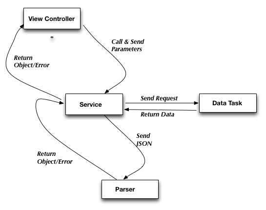
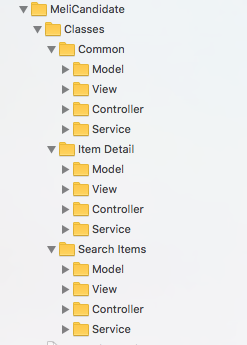
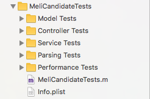

**Este proyecto implementa el ejercicio práctico de Mercado Libre para candidatos iOS**

## Arquitectura

En la implementación se utilizó el patrón de diseño MVCS o Model-View-Controller-Service/Store. Este patrón cumple todos los requerimientos necesarios para que la aplicación tenga una Clean Architecture, ya que separa de los controllers todas las interacciones con la red (o con las bases de datos, si se utilizan); esto da como resultado una arquitectura de capas con controllers más simples y livianos. 
Se puede ver como el MVC, que es la arquitectura default en el ecosistema Apple, extendido por una capa de Servicios que vende instancias de las clases del Model y maneja las comunicaciones con la red, el cache, etc.; cada servicio implementa métodos con completion blocks que devuelven los objetos requeridos o un error en caso de que no sea exitosa la interacción con la red.  

## Clases

###Diagrama de clases

### Model
* MLCItem : Contiene los datos de un item o producto
* MLCSeller : Contiene la información del vendedor de un ítem
* MLCLocation: Contiene la información sobre la localización de un ítem o un vendedor

### View
* El Main Storyboard es el responsable de esta capa. Tiene, embebidos en un Navigation Controller, los dos view controllers utilizados por la aplicación 

* MLCPriceFormatter
* MLCQuantityFormatter
* MLCItemTableViewCell
* MLCIPictureCollectionViewCell

### Controllers
* MLCISearchtemsViewController : Muestra el campo para que el usuario  ingrese el texto de búsqueda; también despliega la lista de ítems que devuelve la API y que contienen el texto buscado.

	##### Data Sources

	- MLCItemsTableViewDataSource
	
		Como su nombre lo indica, es el data source de la tabla que muestra la lista de ítems encontrados.Se inyecta como property en el MLCItemsSearchViewController. Tener los data sources separados de los view controllers, contribuye a que estos últimos sean más simples y livianos.
			
* MLCItemDetailViewController : Muestra el detalle del ítem que el usuario  ha seleccionado previamente de la lista de ítems encontrados por el SearchItemsViewController

	##### Data Sources

	- MLCPicturesCollectionViewDataSource
	
		Como su nombre lo indica, es el data source de la collection view que muestra las fotos de un ítem.Se inyecta como property en el MLCItemDetailViewController

### Service (o Network) Layer

Esta capa es la responsable de comunicarse con la API utilizando las clases de NSURLSession; además, de convertir las respuestas en objetos del model y finalmente pasar estos objetos  a la clase que solicitó su servicio, en general un view controller.
Cada service es responsable de un solo tipo de funcionalidad y realiza las llamadas al endpoint correspondiente; siguiendo el principio de responsabilidad única, en esta capa se definen clases para implementar el parsing de los resultados recibidos
 
 
 
* MLCSearchItemsService

	Este servicio realiza las llamadas a la API para solicitar una búsqueda de ítems y devuelve al caller la lista de ítems encontrados, si la búsqueda es exitosa, o error si la búsqueda falla
	

	##### Parsers
		
	* 	MLCItemsListParser :
			Convierte el JSON recibido por el servicio en un Array con la lista de ítems encontrados
	* 	MLCItemParser :
				Realiza el parsing de la información básica de cada ítem a mostrar en la lista
	* MLCSellerParser	: Realiza el parsing con la información básica del vendedor de un ítem
				
* MLCItemDetailService
 
	Este servicio realiza las llamadas a la API para solicitar la información detallada de un ítem y devuelve dicho ítem con sus datos, en caso de que la solicitud sea exitosa, o error en caso de que falle 	

	##### Parsers
		
	* 	MLCItemDetailParser : Realiza el parsing de la información detallada de un ítem
		
		
## Organización de las carpetas en el proyecto

### Target de la aplicación

Las clases en el target de la aplicación se agrupan  por funcionalidad; dentro de cada funcionalidad se organizan en grupos de acuerdo con el rol que desempeñan en la arquitectura MVCS mencionada en el primer párrafo

* Search Items : Agrupa las clases que se encargan de realizar la búsqueda  solicitada por el usuario  y  de mostrar los ítem encontrados
* Item detail : Agrupa las clases que se encargan de comunicarse con la API para solicitar  el  detalle de un ítem  para posteriormente mostrarlo al usuario
* Common : Agrupa las clases que son utilizadas por todas las funcionalidades de la aplicación

### Target de tests
En el target de unit tests las carpetas se organizan por tipo de test

		
## Unit Tests

En el proyecto se definieron cinco tipos de tests

* Tests para las clases del Model
* Tests para los Controllers
* Tests para los Services
* Tests para los Parsers
* Tests de Performance

Para cada tipo se implementaron algunos de los tests más representativos; el code coverage es del 

## Librerías Externas

En el proyecto se utilizaron las siguientes librerías externas

 
* [SDWebImage](https://github.com/SDWebImage/SDWebImage) : Esta librería baja imágenes de la red de manera asincrónica

## Mensajes de Commits

El proyecto utiliza el estilo sugerido [aquí](http://udacity.github.io/git-styleguide/) ; este estilo incluye un título y un detalle con lista de los cambios realizados

## OCLint (cómo instalar, etc)